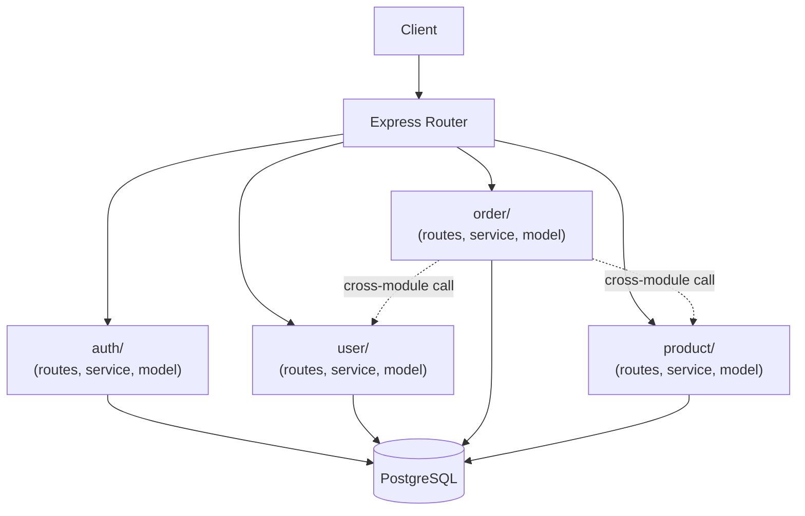
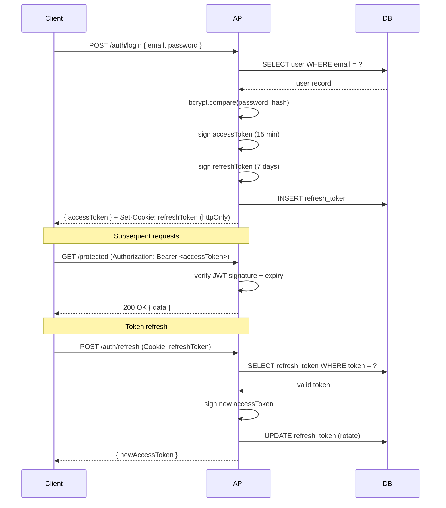
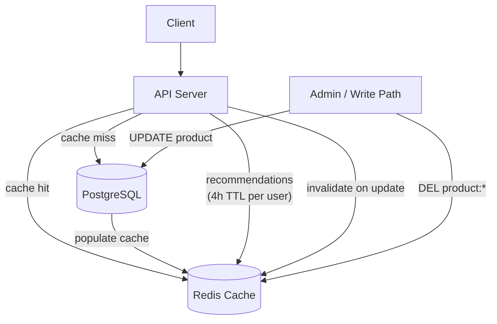
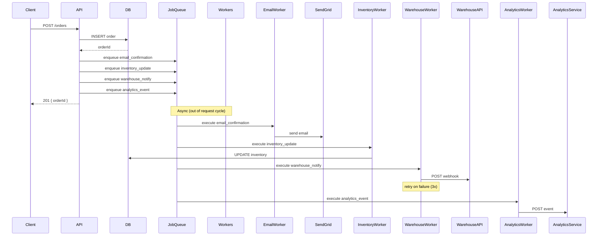

# Winston Arch - Usage Examples

Real architectural analysis sessions showing Explore → Analyze → Design → Trade-offs → Recommend → Document → Diagram.

---

## Example 1: Monolith vs. Microservices

### User Request
```
/winston-arch

Our Express app is getting big (15,000 LOC). Should we break it into microservices?
```

### Winston's Response

```
Exploring: Current Express app structure, module dependencies, deployment setup.

Explored:
- src/ (routes/, services/, models/, middleware/) — flat structure
- 15 route files, 12 service files, 8 models
- Single PostgreSQL database
- Deployed as one Heroku dyno
- package.json: 28 dependencies

Current architecture: Single-process Express monolith with route →
service → model layers. No clear domain boundaries. Shared DB
connection across all services.

Current constraints:
- Team: 2 engineers
- Deployment: Heroku, no Kubernetes or orchestration
- Scale: ~2,000 req/day
- Test coverage: ~15%
- Next major feature: 3 weeks out
```

```
Core tension: Desire for "scalability" vs. operational complexity
the current team can actually manage.

Evaluation criteria:
1. Operational complexity — team has no container orchestration experience
2. Implementation risk — 3-week deadline for next feature
3. Maintainability — current code is becoming hard to navigate
4. Future flexibility — system is growing, need cleaner boundaries

Key risks:
- Microservices at 2,000 req/day is premature optimization
- Distributed system debugging requires tooling the team doesn't have
- Network latency between services adds failure modes
```

```
3 approaches for the codebase organization question:

Approach 1: Domain Modules (in-process)
Description: Reorganize the existing code into domain modules
(user/, order/, product/, notification/) within the same process.
Each module owns its routes, services, and models. Shared DB
connection remains, but access is mediated through module boundaries.
Key changes: Restructure src/ into domain folders; enforce that
modules don't import directly from each other (use events or
explicit cross-module calls).
Effort: 1 week

Approach 2: Modular Monolith with Shared DB
Description: Strict in-process module boundaries with a clear
public API per domain. Modules communicate through well-defined
interfaces. Still one database, but with schema namespacing per
domain (users.*, orders.*, etc.).
Key changes: Introduce domain interfaces; add schema namespacing
in DB migrations; enforce module boundaries via linting rules.
Effort: 2-3 weeks

Approach 3: Microservices
Description: Extract each domain into an independent service with
its own database. Services communicate over HTTP or a message bus
(e.g., RabbitMQ). Deploy independently.
Key changes: New repos or monorepo with service folders; API
contracts between services; separate DBs; service discovery;
centralized logging and tracing.
Effort: 2-3 months
```

```
Trade-off matrix:

| Criterion            | Approach 1  | Approach 2  | Approach 3  |
|----------------------|------------|------------|------------|
| Implementation time  | 1 week      | 2-3 weeks   | 2-3 months  |
| Operational overhead | None        | Low         | Very High   |
| Independent deploys  | No          | No          | Yes         |
| Failure isolation    | Low         | Low         | High        |
| Testability          | Medium      | High        | High        |
| Rollback complexity  | Easy        | Easy        | Complex     |

Notable trade-offs:
- "Approach 1 improves navigation with minimal risk — a good
  first step regardless of future direction."
- "Approach 3 requires orchestration infrastructure (Kubernetes,
  service mesh, distributed tracing) before it pays off."
```

```
Recommend: Approach 1 — Domain Modules (in-process)

Rationale:
- Solves the immediate problem (hard to navigate) without adding
  operational complexity the team can't support today
- 1-week effort doesn't block the 3-week feature deadline
- Creates the domain boundaries that make Approach 2 or 3 easier
  later — this is step 1 on the path, not a dead end
- At 2,000 req/day with 2 engineers, the overhead of microservices
  would dominate development time

This changes if:
- Team grows to 5+ engineers working on the same codebase → Approach 2
- Specific domains need independent scaling (e.g., media processing) → extract that domain only
- Team acquires Kubernetes/container expertise → Approach 3 becomes viable

Next steps:
1. Identify 4-5 core domains from existing routes (user, order, product, auth, notification)
2. Create domain folder structure under src/
3. Move files domain by domain — don't do it all at once
4. Add a linting rule to prevent cross-domain direct imports
```

```markdown
# ADR-001: Adopt Domain Module Structure (In-Process)

**Status:** Proposed
**Date:** 2026-03-02
**Deciders:** Engineering team

## Context

The Express application has grown to 15,000 LOC with a flat file
structure. Finding code is difficult. Adding features requires
understanding many unrelated files. The team is considering
microservices but has no container orchestration experience and
a 3-week feature deadline.

## Decision

Reorganize the codebase into domain modules (user, order, product,
auth, notification) within the existing single-process Express app. 
Each domain owns its routes, services, and models. Modules interact
through explicit cross-module function calls — no direct file imports
across domain boundaries.

## Approaches Considered

### Approach 1: Domain Modules — Selected
In-process domain boundaries. Low risk, 1-week effort.

### Approach 2: Modular Monolith with Schema Namespacing
Stricter boundaries with DB schema namespacing. Good next step after Approach 1.

### Approach 3: Microservices
Independent services with separate databases. Premature for current
team size and request volume.

## Consequences

### Positive
- Codebase is easier to navigate
- Feature work is more contained
- Creates foundation for future service extraction if needed

### Negative
- Does not enable independent deployment
- Still single point of failure (process-level)

### Neutral
- Module boundaries must be enforced by convention/linting (no runtime enforcement)

## Review Conditions

Revisit this decision if:
- Team grows to 5+ engineers regularly conflicting on the same domains
- A specific domain requires independent scaling
- Team acquires container orchestration experience and infrastructure
```



---

## Example 2: Choosing an Authentication Strategy

### User Request
```
/winston-arch

We need to add authentication. What approach should we use?
```

### Winston's Response

```
Exploring: Current app, client types, session/token infrastructure.

Explored:
- React SPA frontend (no server-side rendering)
- REST API backend (Node/Express)
- No existing session infrastructure
- No Redis or distributed cache
- Mobile app planned for Q3
- Third-party integrations expected (partner API access)

Key constraints:
- Mobile app coming soon (stateless auth preferred)
- Possible third-party API consumers
- Single server (no horizontal scaling yet)
- Team familiar with JWT but not OAuth flows
```

```
3 approaches for authentication:

Approach 1: JWT (Stateless)
Description: Issue signed JWTs on login. Clients include the
token in Authorization header. No server-side session storage.
Refresh tokens stored in httpOnly cookies.
Key changes: Login endpoint returns JWT + refresh token; 
auth middleware validates JWT signature; refresh endpoint
rotates tokens.
Effort: 2-3 days

Approach 2: Session-Based (Server-Side)
Description: Store sessions in the database (or Redis). Client
receives a session cookie. Server validates session ID on each
request by querying the session store.
Key changes: Session middleware (express-session); session table
in DB or Redis; logout deletes server-side session.
Effort: 1-2 days (simple), 3-4 days (with Redis)

Approach 3: OAuth 2.0 / OpenID Connect (Delegated)
Description: Use an identity provider (Auth0, Cognito, or
self-hosted) for authentication. App receives tokens via
OAuth flows. Supports SSO and third-party access.
Key changes: OAuth client configuration; callback routes; 
token validation middleware; identity provider setup.
Effort: 1 week + ongoing identity provider management
```

```
Trade-off matrix:

| Criterion               | Approach 1 (JWT) | Approach 2 (Session) | Approach 3 (OAuth) |
|-------------------------|-----------------|---------------------|------------------|
| Implementation time     | 2-3 days         | 1-2 days             | 1+ week           |
| Mobile support          | Excellent        | Awkward (cookies)    | Excellent         |
| Third-party API access  | Good             | Poor                 | Excellent         |
| Token revocation        | Hard             | Easy                 | Built-in          |
| Operational complexity  | Low              | Medium (session store)| High (IdP)        |
| Team familiarity        | High             | Medium               | Low               |

Notable trade-offs:
- "JWT revocation is the hardest problem — short expiry (15 min)
  + refresh tokens is the accepted mitigation."
- "Session-based is simpler if horizontal scaling is never needed; 
  requires a shared session store the moment you run 2 servers."
- "OAuth is the right answer if third-party API consumers are
  confirmed — otherwise it adds complexity prematurely."
```

```
Recommend: Approach 1 — JWT (Stateless)

Rationale:
- Mobile app is coming in Q3 — JWTs are the natural fit for
  mobile clients (no cookie handling complexity)
- Stateless: works without session store, simpler to scale later
- Team is already familiar with JWT
- Use 15-minute access tokens + 7-day refresh tokens in httpOnly
  cookies to mitigate revocation concerns

This changes if:
- Third-party API consumers confirmed in the near term → add
  OAuth 2.0 client credentials flow on top of JWT
- Need immediate token revocation (high-security context) → use
  sessions with Redis

Next steps:
1. Implement login endpoint returning access + refresh tokens
2. Auth middleware: verify JWT signature, check expiry
3. Refresh endpoint: validate refresh token, rotate both tokens
4. Store refresh tokens in DB for revocation support
```



---

## Example 3: Database Strategy for Growing App

### User Request
```
/winston-arch

We're storing everything in MongoDB but our data is getting very relational. 
Should we switch to PostgreSQL?
```

### Winston's Response

```
Exploring: Current data model, query patterns, application code.

Explored:
- 6 Mongoose models: User, Order, OrderItem, Product, Category, Review
- Frequent aggregation pipelines joining orders → users → products
- $lookup chains 3-4 levels deep in some queries
- Slow query logs show aggregations at ~800ms average
- 1.2M documents in orders collection
- Application code: heavy use of populate() chains

Key constraints:
- 1.2M order documents — migration is non-trivial
- Application code tightly coupled to Mongoose API
- No dedicated DBA on team
- New reporting feature requires complex joins
```

```
Core tension: Existing investment in MongoDB (code, data) vs.
relational data model that PostgreSQL handles natively.

Evaluation criteria:
1. Query performance — 800ms averages are a user-facing problem
2. Migration risk — 1.2M documents, running production system
3. Data model fit — data is clearly relational
4. Development velocity — reporting feature needs complex joins

Key risks:
- Full migration could take weeks and carries rollback complexity
- Hybrid approach adds operational complexity (two databases)
- Staying in MongoDB may require significant aggregation optimization
```

```
3 approaches:

Approach 1: Optimize MongoDB Aggregations
Description: Audit and optimize existing aggregation pipelines.
Add compound indexes, rewrite $lookup chains, use $facet for
reporting queries. Keep MongoDB.
Key changes: New indexes; rewritten aggregation pipelines in
query layer; possibly materialize frequently-needed views.
Effort: 1 week

Approach 2: Hybrid — PostgreSQL for Relational, MongoDB for Documents
Description: Introduce PostgreSQL for the relational entities
(User, Order, OrderItem, Product, Category). Keep MongoDB for
document-oriented data (Reviews, UserPreferences, ProductCatalog
rich attributes).
Key changes: New PostgreSQL schema + migrations; migrate 4 of 6
models; update application code for migrated models; dual DB
connection.
Effort: 3-4 weeks

Approach 3: Full Migration to PostgreSQL
Description: Migrate all 6 models to PostgreSQL. Use Prisma or
Knex as ORM. Rewrite data access layer.
Key changes: Full schema design; data migration scripts; 
rewrite all Mongoose queries to SQL; update application layer.
Effort: 6-8 weeks
```

```
Trade-off matrix:

| Criterion            | Approach 1   | Approach 2      | Approach 3   |
|----------------------|-------------|----------------|-------------|
| Implementation time  | 1 week       | 3-4 weeks       | 6-8 weeks    |
| Query performance    | Moderate gain| High gain       | High gain    |
| Data model fit       | Poor (stays) | Good            | Excellent    |
| Migration risk       | None         | Medium          | High         |
| Operational overhead | Low          | High (2 DBs)    | Low (1 DB)   |
| Reporting capability | Limited      | Excellent (PG)  | Excellent    |

Notable trade-offs:
- "Approach 1 may not be enough — relational data in a document
  store has a ceiling on query optimization."
- "Approach 2 solves the problem faster than Approach 3 but
  leaves you running two databases indefinitely."
- "Approach 3 is the right long-term answer but carries real
  migration risk on a live 1.2M document system."
```

```
Recommend: Approach 2 (Hybrid), with a plan to reach Approach 3

Rationale:
- Reporting feature is urgent — PostgreSQL is needed now for
  complex joins
- Full migration (Approach 3) in a running production system
  is risky without a dedicated migration window
- Hybrid lets you migrate domain by domain, validating each step
- Start with Order/OrderItem/Product (where the pain is), then
  migrate remaining models over the next quarter → eventually
  reach Approach 3 without a big-bang migration

Concrete plan:
- Week 1-2: Set up PostgreSQL, migrate Order + OrderItem + Product
- Week 3-4: Migrate User + Category; update all queries
- Quarter 2: Migrate Reviews; evaluate MongoDB removal

This changes if:
- Team can schedule a migration window with reduced traffic →
  do Approach 3 directly
- MongoDB performance issues resolve with indexing → stay on Approach 1

Next steps:
1. Design PostgreSQL schema for Order, OrderItem, Product
2. Write migration script (MongoDB → PostgreSQL) with validation
3. Run dual-write during migration to validate data consistency
4. Cut over queries domain by domain
```

---

## Example 4: Caching Strategy

### User Request
```
/winston-arch

Our API is getting slow under load. We need caching. Where should we add it?
```

### Winston's Response

```
Exploring: Slow endpoints, query patterns, current infrastructure.

Explored:
- 3 endpoints account for 80% of traffic:
  GET /products (catalog, 1,200 calls/min)
  GET /products/:id (product detail, 800 calls/min)
  GET /users/:id/recommendations (ML-generated, 400 calls/min)
- Product catalog changes: ~50 updates/day
- Recommendations refresh: every 4 hours per user
- Infrastructure: single Node.js process, PostgreSQL, no Redis

Key constraints:
- No Redis in current infrastructure
- Product data changes ~50 times/day (cache invalidation matters)
- Recommendations are expensive to compute (100ms+ ML call)
- Budget for infrastructure increase: moderate
```

```
3 approaches for caching:

Approach 1: In-Process Memory Cache (node-cache / lru-cache)
Description: Add an in-memory LRU cache in the Node.js process
for product catalog and recommendations. TTL-based invalidation.
No new infrastructure required.
Key changes: Add node-cache or lru-cache; wrap repository calls
with cache layer; set TTLs per data type.
Effort: 1 day
Limitation: Cache is lost on restart; not shared across
multiple Node processes.

Approach 2: Redis Cache
Description: Add Redis as a shared cache. Cache product catalog
(TTL: 10 min), product details (TTL: 10 min), and user
recommendations (TTL: 4 hours). On write, invalidate affected
cache keys.
Key changes: Redis connection; cache-aside pattern in service
layer; cache invalidation on product update.
Effort: 2-3 days (+ Redis infrastructure)

Approach 3: CDN + Redis + HTTP Cache Headers
Description: Serve public endpoints (product catalog, product
detail) through a CDN (Cloudflare). Set Cache-Control headers.
Use Redis for private/user-specific data (recommendations).
Key changes: CDN configuration; Cache-Control headers on public
routes; Redis for recommendations.
Effort: 1 week
```

```
Trade-off matrix:

| Criterion              | Approach 1    | Approach 2    | Approach 3    |
|------------------------|--------------|--------------|--------------|
| Implementation time    | 1 day         | 2-3 days      | 1 week        |
| Infrastructure change  | None          | Add Redis     | CDN + Redis   |
| Cache effectiveness    | Medium        | High          | Very High     |
| Consistency            | Eventually    | Good          | Good          |
| Multi-instance support | No            | Yes           | Yes           |
| Cost                   | Free          | ~$15/mo Redis | $15-50/mo     |

Notable trade-offs:
- "Approach 1 solves the problem today with zero infrastructure
  cost — good first step."
- "Approach 3 is the highest-performance option but CDN setup
  takes time and requires careful Cache-Control header design."
```

```
Recommend: Approach 2 — Redis Cache

Rationale:
- Approach 1 is fragile (lost on restart, not shareable) — not
  appropriate for production at your current load
- Redis is the standard solution; straightforward to add with
  ioredis; Heroku Redis is ~$15/mo
- Recommendation caching (4-hour TTL) removes the ML call
  bottleneck immediately
- Product catalog (10-min TTL + invalidation on write) handles
  the 1,200 calls/min without hammering PostgreSQL

This changes if:
- Budget is zero → start with Approach 1, migrate to Redis in
  the next sprint
- Load grows significantly (100K+ req/min) → add CDN for public
  catalog (Approach 3)

Next steps:
1. Provision Redis (Heroku Redis or Railway)
2. Create cache service wrapper (get/set/invalidate)
3. Cache product catalog and product detail with 10-min TTL
4. Cache recommendations with 4-hour TTL per userId
5. Add cache invalidation to product write paths
```



---

## Example 5: Introducing a Message Queue

### User Request
```
/winston-arch

When users place orders, we need to: send a confirmation email, 
update inventory, notify the warehouse, and update analytics. 
Currently we do this synchronously in the order handler and 
it's slow and fragile.
```

### Winston's Response

```
Exploring: Current order handler, downstream integrations.

Explored:
- routes/orders.ts: POST /orders calls 4 services sequentially
- Email: sends via SendGrid SDK (~300ms)
- Inventory: direct DB update (~50ms)
- Warehouse: HTTP POST to external webhook (~500ms, occasionally times out)
- Analytics: HTTP POST to analytics service (~200ms)
- Total order handler time: ~1,050ms p50, up to 3s on timeouts

Key constraints:
- Warehouse webhook is unreliable (times out ~5% of requests)
- Email delivery failures currently cause order failures (wrong coupling)
- Analytics is non-critical — eventual consistency acceptable
- Team has no message broker experience
```

```
3 approaches for decoupling post-order processing:

Approach 1: Fire-and-Forget (Async, No Queue)
Description: After saving the order to the DB, fire async
functions for email, inventory, warehouse, and analytics without
awaiting them. Return 201 immediately. Use try/catch per task
with logging.
Key changes: Wrap downstream calls in non-awaited async
functions; add error logging per task; remove from critical path.
Effort: 2-3 hours
Limitation: No retry on failure; if process crashes mid-execution,
tasks are lost.

Approach 2: Database-Backed Job Queue (pg-boss / BullMQ with Redis)
Description: After saving the order, enqueue jobs for each
post-order task. A worker process dequeues and executes them
with retry logic. BullMQ uses Redis; pg-boss uses PostgreSQL
(no new infra).
Key changes: Job queue setup; worker process; enqueue in order
handler; implement job handlers per task.
Effort: 2-3 days

Approach 3: Message Broker (RabbitMQ / AWS SQS)
Description: Publish an OrderCreated event to a message broker. 
Independent consumers (email service, inventory service, etc.)
subscribe and process. Full event-driven architecture.
Key changes: Message broker infrastructure; producer code in
order handler; consumer services per domain; dead-letter queues.
Effort: 1-2 weeks
```

```
Trade-off matrix:

| Criterion           | Approach 1      | Approach 2       | Approach 3    |
|---------------------|----------------|-----------------|--------------|
| Implementation time | 2-3 hours       | 2-3 days         | 1-2 weeks     |
| Reliability         | Low (no retry)  | High (retry)     | Very High     |
| Failure visibility  | Logs only       | Queue dashboard  | Full tracing  |
| Infra required      | None            | Redis or PG      | Broker infra  |
| Ordering guarantees | None            | Configurable     | Strong        |
| Complexity          | Very Low        | Medium           | High          |

Notable trade-offs:
- "Approach 1 is a good immediate improvement — removes warehouse
  timeout from the critical path — but doesn't solve the
  reliability problem."
- "Approach 2 with pg-boss requires no new infrastructure
  (uses existing PostgreSQL) and gives retry + visibility."
```

```
Recommend: Approach 2 — pg-boss (Database Job Queue)

Rationale:
- pg-boss uses the existing PostgreSQL — no new infrastructure
- Gives retry logic (warehouse webhook failures are retried
  automatically), visibility into job state, and dead-letter
  queues for failures
- Order handler returns in <100ms (DB write only)
- Workers run in a separate process — failures don't affect
  the API
- If you later need cross-service events, pg-boss jobs are
  easy to replace with a message broker

This changes if:
- Multiple services (not just this app) need to consume
  OrderCreated events → move to Approach 3 (SQS or RabbitMQ)
- Job volume exceeds PostgreSQL capacity (~10K jobs/sec) →
  switch to BullMQ + Redis

Next steps:
1. Install pg-boss; initialize job queue
2. Refactor order handler: save order → enqueue 4 jobs → return 201
3. Implement job workers: email, inventory, warehouse, analytics
4. Configure retry policies (warehouse: 3 retries with backoff)
5. Add job failure alerting
```



---

## Tips for Working with Winston

### 1. Give Context About Team and Scale
Winston's recommendations depend heavily on team size, operational
experience, and current scale. The more context, the better.

**Good:** "We're 2 engineers, 500 req/day, no DevOps experience."
**Less useful:** "We need to scale."

### 2. Describe the Pain, Not the Solution
Let Winston identify the approach. Describing the symptoms leads
to better analysis than asking about a specific technology.

**Good:** "Our order handler is slow and fragile."
**Less useful:** "Should we use Kafka?"

### 3. Share Constraints Openly
Budget, timeline, team skills, and existing infrastructure all
affect the recommendation. Winston won't judge your constraints.

### 4. Ask About Trade-offs
If you want to understand a specific trade-off more deeply, ask.
Winston will go deeper on any dimension.

### 5. Review the ADR Before Implementing
The ADR captures the reasoning. Future team members will thank you.

---

## What Winston Does NOT Do

❌ Write implementation code (use /barry-quickdev for that)
❌ Write tests (use /amelia-tdd for that)
❌ Make quick tactical decisions (use /barry-quickdev for that)
❌ Recommend without exploring first

✅ Winston is for: Architectural decisions, design trade-offs,
system design, technology selection, ADRs, Mermaid diagrams

---

**END OF EXAMPLES**
