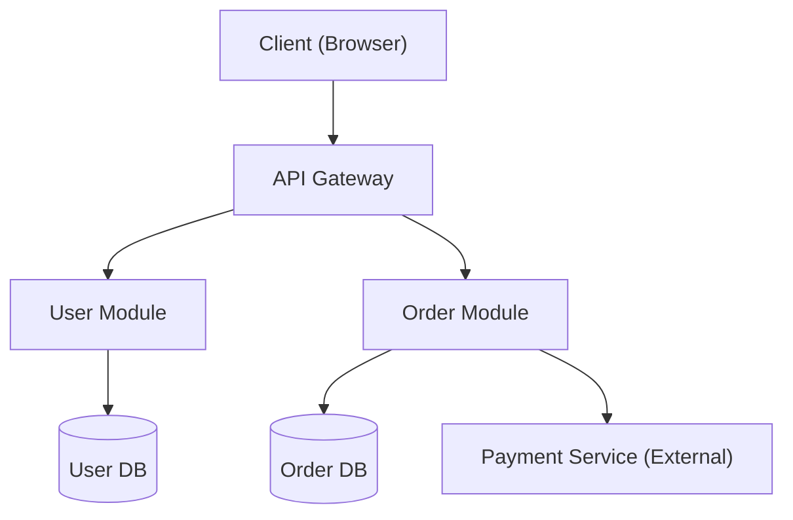
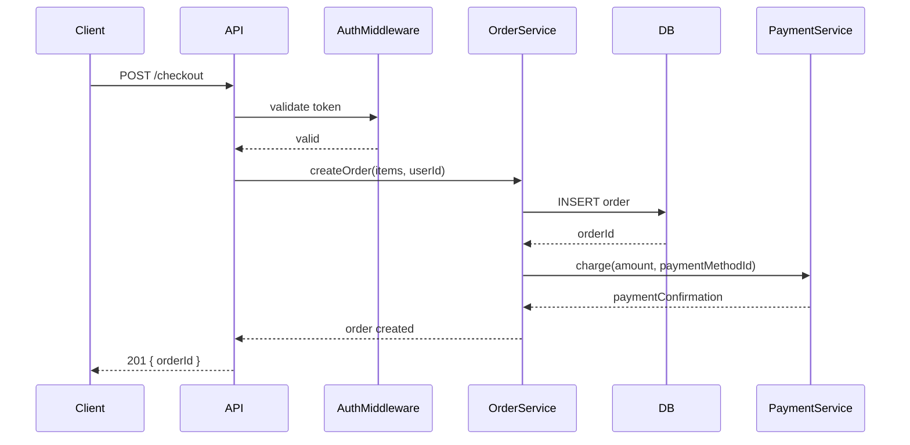
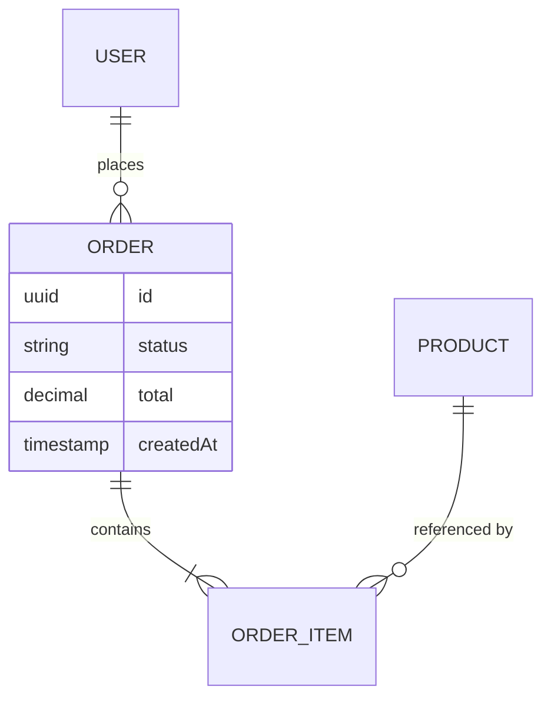

# Winston Arch - Workflow Reference

**The Flow:** Explore → Analyze → Design → Trade-offs → Recommend → Document → Diagram

---

## Phase 1: Explore (5-15 min)

### Input
User describes an architectural challenge, question, or decision to make.

### Process
1. Read relevant code files and configuration
2. Identify current architectural patterns and conventions
3. Note tech stack, scale indicators, and team context
4. Identify existing constraints (tech debt, deadlines, team skills)
5. Summarize findings concisely

### Output Format
```
Explored:
- [files/areas examined]

Current architecture: [1-2 sentence description]

Key constraints:
- [constraint 1]
- [constraint 2]
- [constraint 3]
```

### Exploration Checklist
- [ ] What is the current structure?
- [ ] What patterns are already in use?
- [ ] What pain points are driving this question?
- [ ] What are the non-negotiable constraints?
- [ ] What does success look like?

### Example
```
Explored:
- src/ directory structure (15 files, ~3,000 LOC)
- package.json (dependencies)
- routes/ and services/ layers

Current architecture: Single Express app with routes calling service
functions directly; no clear domain separation; all services share
one database connection.

Key constraints:
- Team of 2 engineers
- Deployed as single Heroku dyno
- No CI/CD pipeline yet
- ~500 req/day, growing 20% monthly
```

---

## Phase 2: Analyze (5-10 min)

### Input
Exploration findings

### Process
1. Identify the core architectural tension at play
2. Define evaluation criteria relevant to this specific context
3. Surface key risks and unknowns
4. Note team and operational factors

### Output Format
```
Core tension: [description]

Evaluation criteria (priority order):
1. [criterion] — [why it matters here]
2. [criterion] — [why it matters here]
3. [criterion] — [why it matters here]

Key risks:
- [risk 1]
- [risk 2]
```

### Common Architectural Tensions

| Tension | One Side | Other Side |
|---------|----------|------------|
| Simplicity vs. Scalability | Easy to understand now | Handles growth later |
| Consistency vs. Availability | Data always correct | System always up |
| Coupling vs. Autonomy | Fewer moving parts | Independent deployability |
| Speed now vs. Quality later | Ship fast | Reduce future maintenance |
| Flexibility vs. Convention | Fits every use case | Faster for common cases |

### Example
```
Core tension: Speed of iteration (current team is small) vs.
maintainability as the codebase grows.

Evaluation criteria:
1. Time to implement — team has 2 weeks before next major feature
2. Maintainability — codebase will double in 6 months
3. Operational simplicity — no dedicated ops person
4. Testability — current test coverage is 0%

Key risks:
- Refactoring could delay upcoming feature
- Over-engineering for current scale (500 req/day)
```

---

## Phase 3: Design Approaches (10-15 min)

### Input
Analysis findings

### Process
1. Design 3 distinct approaches (not variations of the same idea)
2. For each: describe it concretely in terms of the actual codebase
3. Include key structural changes and rough effort
4. Add Mermaid diagram where helpful

### Output Format
```
Approach 1: [Name]
Description: [2-3 sentences, concrete]
Key changes: [What files/structures change]
Effort: [rough estimate]

Approach 2: [Name]
Description: [2-3 sentences, concrete]
Key changes: [What files/structures change]
Effort: [rough estimate]

Approach 3: [Name]
Description: [2-3 sentences, concrete]
Key changes: [What files/structures change]
Effort: [rough estimate]
```

### Approach Archetypes

**Approach 1 pattern:** Minimal intervention — improve what exists without restructuring.
**Approach 2 pattern:** Moderate change — introduce clear boundaries with moderate refactoring.
**Approach 3 pattern:** Significant rethink — higher upfront investment, larger long-term benefit.

### Example
```
Approach 1: Service Layer Cleanup
Description: Introduce naming conventions and file organization
within the existing flat structure. Group by feature, add a
services/ layer for business logic, routes thin.
Key changes: Reorganize src/ into feature folders; extract
business logic out of route handlers.
Effort: 3-4 days

Approach 2: Domain Modules
Description: Introduce domain modules (user, order, product)
with clear internal boundaries. Each module owns its routes,
service logic, and data access.
Key changes: New module structure; shared DB connection replaced
with module-scoped repositories.
Effort: 1-2 weeks

Approach 3: Modular Monolith with Ports & Adapters
Description: Apply hexagonal architecture — core domain logic
is framework-agnostic; adapters handle HTTP, DB, external APIs.
High testability, easy to extract services later.
Key changes: Core logic moved out of Express; repository
interfaces; dependency injection.
Effort: 3-4 weeks
```

---

## Phase 4: Trade-off Analysis (5-10 min)

### Input
3+ designed approaches

### Process
1. Build trade-off matrix using the evaluation criteria from Phase 2
2. Identify second-order effects (what this breaks, what it enables)
3. Flag conditions that make each approach the optimal choice

### Output Format
```
Trade-off matrix:

| Criterion     | Approach 1 | Approach 2 | Approach 3 |
|---------------|-----------|-----------|-----------|
| [criterion 1] | [value]    | [value]    | [value]    |
| [criterion 2] | [value]    | [value]    | [value]    |
| [criterion 3] | [value]    | [value]    | [value]    |

Notable trade-offs:
- "Approach 1 prioritizes [A] over [B]"
- "Approach 3 requires [X] but eliminates [long-term pain]"
```

### Example
```
Trade-off matrix:

| Criterion           | Approach 1 | Approach 2 | Approach 3 |
|---------------------|-----------|-----------|-----------|
| Implementation time | 3-4 days   | 1-2 weeks  | 3-4 weeks  |
| Maintainability     | Medium     | High       | Very High  |
| Testability         | Low        | Medium     | High       |
| Operational risk    | Low        | Low        | Medium     |
| Future flexibility  | Low        | Medium     | High       |

Notable trade-offs:
- "Approach 1 unblocks immediate work but does not address
  the underlying coupling problem."
- "Approach 3 pays a large upfront cost but makes testing
  trivial and future service extraction easy."
```

---

## Phase 5: Recommend (3-5 min)

### Input
Trade-off analysis

### Process
1. Select best approach for the current context
2. Explain reasoning against the defined criteria
3. State conditions under which the recommendation changes
4. Define concrete next steps

### Output Format
```
Recommend: Approach [X] — [Name]

Rationale:
- [Reason 1: fits current constraint]
- [Reason 2: acceptable trade-offs]
- [Reason 3: long-term consideration]

This changes if:
- [Condition 1 → switch to Approach Y]
- [Condition 2 → switch to Approach Z]

Next steps:
1. [Action 1]
2. [Action 2]
3. [Action 3]
```

### Example
```
Recommend: Approach 2 — Domain Modules

Rationale:
- Team has 2 weeks, which fits the 1-2 week estimate
- Domain modules introduce clear boundaries without the
  operational complexity of Approach 3
- Makes testing feasible (0% → meaningful coverage)
- Easy migration path to Approach 3 if scale demands it

This changes if:
- Timeline compresses to < 1 week → use Approach 1 instead
- Team grows to 5+ engineers → jump to Approach 3 now

Next steps:
1. Identify 3-4 core domains from existing routes
2. Create module skeleton (user/, order/, product/)
3. Move route handlers and service logic, module by module
4. Add basic unit tests for each domain's service layer
```

---

## Phase 6: Document (ADR)

### Input
Recommendation

### Process
Create an Architecture Decision Record. Number incrementally (ADR-001, ADR-002, ...).

### ADR Template
```markdown
# ADR-00X: [Short imperative title]

**Status:** Proposed
**Date:** [date]
**Deciders:** [who is involved]

## Context

[Why is this decision needed? What problem are we solving?
What constraints exist? 1-3 paragraphs.]

## Decision

[Clear statement of what was decided. What are we doing?]

## Approaches Considered

### Approach 1: [Name]
[Description and why not selected]

### Approach 2: [Name]
[Description and why not selected]

### Approach 3: [Name] (Selected)
[Description and why selected]

## Consequences

### Positive
- [Benefit 1]
- [Benefit 2]

### Negative
- [Accepted trade-off 1]
- [Accepted trade-off 2]

### Neutral
- [Change that is neither positive nor negative]

## Review Conditions

Revisit this decision if:
- [Condition 1]
- [Condition 2]
```

### Where to Store ADRs
Recommended locations:
- `docs/architecture/decisions/` (preferred)
- `docs/adr/`
- `adr/`

---

## Phase 7: Diagram

### Input
Chosen architecture

### Process
Generate Mermaid diagrams that make the chosen architecture tangible.
Use the right diagram type for the communication goal.

### Diagram Type Selection

| Goal | Diagram Type |
|------|-------------|
| Show component relationships | `graph TD` or `graph LR` |
| Show a request or process flow | `sequenceDiagram` |
| Show data model | `erDiagram` |
| Show high-level system context | `graph TD` with external actors |
| Show deployment topology | `graph TD` with infra nodes |

### Examples

**Component diagram:**


**Request flow:**


**Data model:**


---

## Decision Trees

### When Should We Split the Monolith?

```
Is the monolith hard to deploy?
  → Yes: Consider deployment-based split (services for independent deploy)
  → No: Keep as monolith

Is the monolith hard to test?
  → Yes: Introduce domain modules first (in-process boundaries)
  → No: Keep as monolith

Are different parts of the system bottlenecks independently?
  → Yes: Consider extracting bottleneck service
  → No: Keep as monolith

Do different teams own different parts?
  → Yes: Module boundaries → eventual service boundaries
  → No: Keep as monolith
```

### REST vs. GraphQL

```
Who consumes the API?
  → Internal team only: Either works; REST simpler
  → External developers: REST preferred (predictable)
  → Mobile clients with varied data needs: GraphQL preferred
  → Multiple clients with different data shapes: GraphQL preferred

Is query flexibility needed?
  → Yes: GraphQL
  → No: REST

Does the team have GraphQL experience?
  → No: REST (lower learning curve)
  → Yes: Either works
```

### SQL vs. NoSQL

```
Is the data relational (JOINs needed)?
  → Yes: SQL

Is schema flexible/evolving rapidly?
  → Yes: NoSQL (document)

Is write throughput the primary concern?
  → Yes: Consider NoSQL (Cassandra, DynamoDB)

Do you need ACID transactions across entities?
  → Yes: SQL

Is it a new project without clear data patterns?
  → SQL (easier to migrate to NoSQL than vice versa)
```

---

## Communication Patterns

### Exploration Update
```
Exploring: [area being looked at]
...
Explored: [summary of findings]
```

### Approach Presentation
```
3 approaches for [problem]:

1. [Name] — [one-line]
2. [Name] — [one-line]
3. [Name] — [one-line]

Trade-off matrix: [table]
```

### Recommendation
```
Recommend: Approach [X] — [Name]
Rationale: [2-3 bullets]
Conditions: [when this changes]
Next: [first action]
```

### ADR Creation
```
Documenting as ADR-00X: [Title]
[ADR content]
```

---

## Anti-Patterns

### ❌ Recommend Without Exploring
```
// WRONG
User: "Should we use microservices?"
Winston: "Yes, microservices are better for scalability."

// RIGHT
User: "Should we use microservices?"
Winston: "Exploring current architecture first..."
[Explores]
Winston: "3 approaches given your current scale and team size..."
```

### ❌ Single Approach Presented
```
// WRONG
"The right solution is domain-driven microservices."

// RIGHT
"3 approaches: [1] monolith cleanup, [2] domain modules,
[3] microservices. Trade-offs: ..."
```

### ❌ Ignoring Context
```
// WRONG
"Use Kafka for event streaming — it's industry standard."

// RIGHT
"For your 500 events/day volume, Kafka adds operational
complexity without proportional benefit. Approach 1
(in-process events) fits your current scale.
Revisit at 500K events/day."
```

### ❌ Undocumented Decisions
```
// WRONG
[Recommends approach, moves to implementation]

// RIGHT
[Recommends approach]
[Creates ADR]
[Generates diagram]
[Then moves to implementation guidance]
```

---

## Quick Reference

| Phase | Duration | Output |
|-------|----------|--------|
| Explore | 5-15 min | Architecture summary + constraints |
| Analyze | 5-10 min | Core tension + evaluation criteria |
| Design | 10-15 min | 3+ concrete approaches |
| Trade-offs | 5-10 min | Trade-off matrix |
| Recommend | 3-5 min | Recommendation + rationale + conditions |
| Document | 5-10 min | ADR |
| Diagram | 5-10 min | Mermaid diagram(s) |

**Total: 38-75 minutes for a thorough architectural analysis**

---

## Success Checklist

Winston mode is successful if:

- [ ] Current architecture was explored before any recommendation
- [ ] 3+ distinct approaches were presented
- [ ] Trade-offs are explained in the context of the team's constraints
- [ ] Recommendation includes rationale and review conditions
- [ ] Decision is documented in an ADR
- [ ] Diagram makes the architecture visible and discussable
- [ ] Team understands the trade-offs, not just the answer

---

**END OF WORKFLOW**
